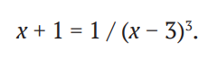
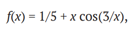

#Лекция 10
#Domaratsky 
Оптимизация, подгонка данных и численные методы решения уравнений

Упражнения

1) Использовать метод scipy.optimize.brentq для поиска решений уравнения

    import numpy as np
    from scipy.optimize import brent

    f = lambda x: x + 1 + (x - 3)**-3
    brentq(f, -2, -0.5), brentq(f, 0, 2.99)

2) Найти все корни функции

используя: а) метод scipy.optimize.brentq, б) метод scipy.optimize.newton.

    import numpy as np
    from scipy.optimize import brentq, newton

    f = lambda x: 0.2 + x*np.cos(3/x)

    x, dx = np.linspace(-1, 1, 1000, retstep=True)
    lower_bounds = x[np.sign(f(x[1:])) != np.sign(f(x[:-1]))]

    brent_roots = np.array([brentq(f, a, a+dx) for a in lower_bounds])

    fp = lambda x: np.cos(3/x) + 3/x * np.sin(3/x)
    newton_roots = np.array([newton(f, a, fp) for a in lower_bounds])
    print('Roots of f(x) = x.cos(3/x):')
    print('{:11s} {:11s}'. format('Brent', 'Newton'))
    r = np.vstack((brent_roots, newton_roots)).T

    for br, nr in r:
        print('{:11.8f} {:11.8f}'.format(br, nr))