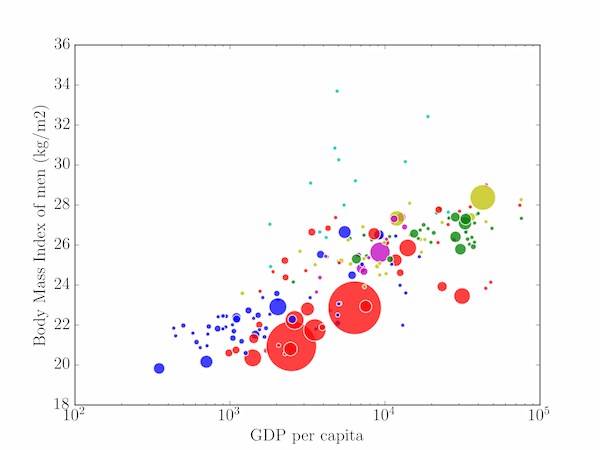

Лекция 7 Линейные графики и точечные диаграммы  
  
Упражнения  
  
Задание 1  
  
Чтобы пометить пузырьки в примере 1, добавьте следующий код перед отображением графика:  
offset = 1  
for x, y, s, country in zip(birth_rate, life_expectancy, GDP, countries):  
    ax.text(x+offset, y, country, va='center')  

Задание 2  
Кружковая («пузырьковая») диаграмма представляет собой тип точечной диаграммы, который может отображать три измерения данных с использованием позиции (точки данных как координаты x и y) и размера маркера. Метод plt.scatter может создавать кружковые диаграммы, принимая размер маркера в атрибуте s  (в кв. пт. – так что площадь маркера пропорциональна величине в третьем измерении – см. пример П7.1).  
Файлы gdp.tsv, bmi_men.tsv и population_total.tsv, доступные для скачивания в ресурсах, содержат следующие данные, начиная с 2007 г. для каждой страны: ВВП на душу населения в международных долл., зафиксированных в ценах 2005 г., индекс массы тела (ИМТ) мужчин (в  кг/м2 ) и  общая численность населения. Создать кружковую диаграмму отношения ИМТ и ВВП, на которой численность населения соответствует размеру круговых маркеров. Предупреждение: для некоторых стран отдельные точки данных отсутствуют. Дополнительное задание: обозначить цветом кружки по континентам, используя список из файла continents.tsv.

