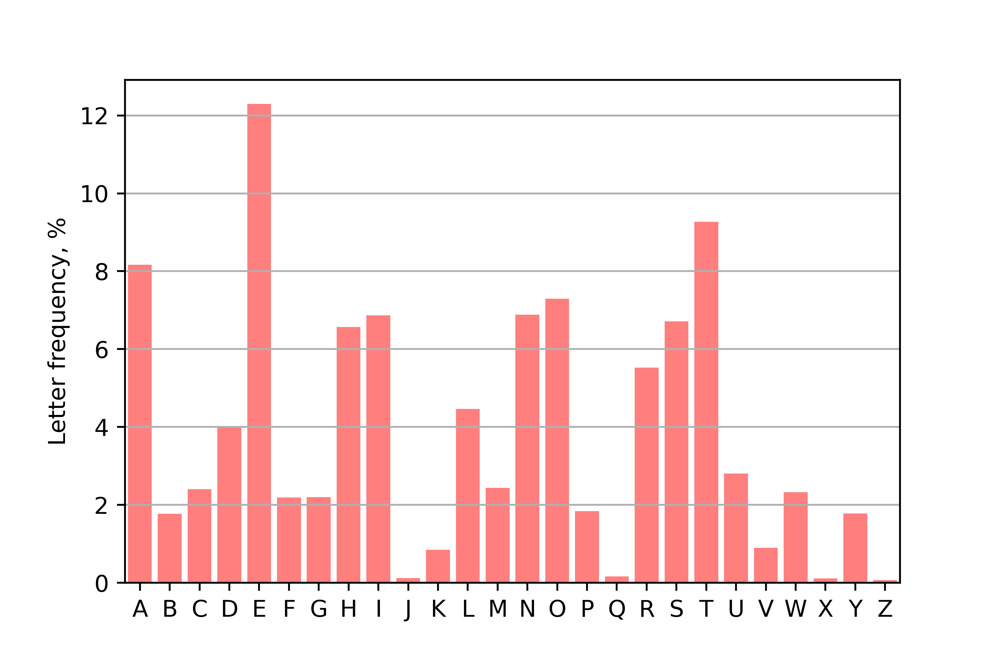

Лекция 8   
  
Столбиковые диаграммы, круговые диаграммы и диаграммы в полярных координатах  
  
Задание:  
- реализовать примеры 1 - 3, изменив цвет на любой  
- реализовать примеры 4, 5 с применением длины волны 

_для_системы_из_двух_антенн.png)
_для_системы_из_трёх_антенн.png)