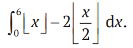
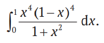
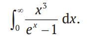
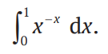
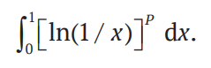
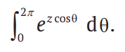

#Лекция 9
#Domaratsky  
Интегрирование
  
Упражнения

Задание 1. Использовать метод scipy.integrate.quad для вычисления следующего интеграла:

Задание 2. Использовать метод scipy.integrate.quad для вычисления следующих определенных интегралов (большинство из них можно также представить в конечной форме в заданном интервале, но это затруднительно).

    f1 = lambda x: x**4 * (1 -x)**4/(1 + x**2)
    quad(f1, 0, 1)

    22/7 - np.pi
    

    f2 = lambda x: x**3/(np.exp(x) - 1)
    quad(f2, 0, np.inf)

    np.pi**4 / 15

    f3 = lambda x: x**-x
    quad(f3, 0, 1)

    n, I, TOL = 0, 0, 1.e-16
    while True:
        Iold = I
        n += 1
        I += n**-n
        if I-Iold < TOL:
            break

    I

    from scipy.misc import factorial
    f4 = lambda x, p: np.log(1/x)**p

    for p in range(10):
        print(quad(f4, 0, 1, args=(p,))[0], factorial(p))

    from scipy.special import i0
    z = np.linspace(0, 2, 100)
    y1 = i0(z)
    f5 = lambda theta, z: np.exp(z*np.cos(theta))
    y2 = np.array([quad(f5, 0, 2*np.pi, args=(zz,))[0] for zz in z])
    y2 /= 2 * np.pi
    np.max(abs(y2-y1))