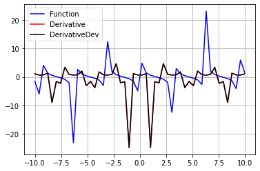

## Практическая работа 12 ##

##  Найти первую и вторую производные, а таже построить график функции, первой и второй ее производных для cos(x), sin(x), tg(x), ctg(x) ##


## Производная функции при помощи cos ##
```python
import matplotlib.pyplot as plt
import numpy as np
import math
from scipy.misc import derivative

def fun(x):
    return np.cos(x)

def derivate(x):
    return derivative(fun, x)

y_val = np.linspace(-10, 10)


plt.plot(y_val, fun(y_val), color='blue', label='Function')

plt.plot(y_val, derivate(y_val), color='red', label='Derivative')

plt.plot(y_val, derivate(y_val), color='black', label='DerivativeDer')

plt.legend(loc='upper left')
plt.grid(True)
```


    

    


## Производная функции при помощи tan ##
```python
import matplotlib.pyplot as plt
import numpy as np
import math
from scipy.misc import derivative

def fun(x):
    return np.tan(x)

def derivate(x):
    return derivative(fun, x)

y_val = np.linspace(-10, 10)


plt.plot(y_val, fun(y_val), color='blue', label='Function')

plt.plot(y_val, derivate(y_val), color='red', label='Derivative')

plt.plot(y_val, derivate(y_val), color='black', label='DerivativeDer')

plt.legend(loc='upper left')
plt.grid(True)
```


    

    


## Производная функции при помощи sin ##
```python
import matplotlib.pyplot as plt
import numpy as np
import math
from scipy.misc import derivative

def fun(x):
    return np.sin(x)

def derivate(x):
    return derivative(fun, x)

y_val = np.linspace(-10, 10)


plt.plot(y_val, fun(y_val), color='blue', label='Function')

plt.plot(y_val, derivate(y_val), color='red', label='Derivative')

plt.plot(y_val, derivate(y_val), color='black', label='DerivativeDev')

plt.legend(loc='upper left')
plt.grid(True)
```


    

    


## Производная функции при помощи ctan ##
```python
import matplotlib.pyplot as plt
import numpy as np
import math
from scipy.misc import derivative

def fun(x):
    return 1/np.tan(x)

def derivate(x):
    return derivative(fun, x)

y_val = np.linspace(-10, 10)


plt.plot(y_val, fun(y_val), color='blue', label='Function')

plt.plot(y_val, derivate(y_val), color='red', label='Derivative')

plt.plot(y_val, derivate(y_val), color='black', label='DerivativeDev')

plt.legend(loc='upper left')
plt.grid(True)
```


    

    


```python

```
