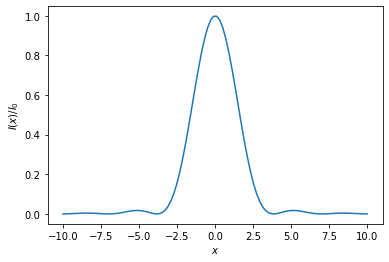

```python
#Задание №1

import numpy as np
from scipy.special import binom

nmax = 8
for n in range(nmax+1):
    fmt = ' {:^3d}'*(n+1)
    pascal_row = fmt.format(*np.array(binom(n, np.arange(n+1)), dtype='i4'))
    print('{:^40s}'.format(pascal_row))
```

                        1                   
                      1   1                 
                    1   2   1               
                  1   3   3   1             
                1   4   6   4   1           
              1   5  10  10   5   1         
            1   6  15  20  15   6   1       
          1   7  21  35  35  21   7   1     
        1   8  28  56  70  56  28   8   1   
    


```python
#Задание №2

import numpy as np
import matplotlib.pyplot as plt
from scipy.special import jn, jn_zeros

fig = plt.figure()
ax = fig.add_subplot(111)

x = np.linspace(-10, 10, 100)

jinc = lambda x: jn(1, x) / x
airy = (2 * jinc(x))**2
ax.plot(x,airy)
ax.set_xlabel('$x$')
ax.set_ylabel('$I(x)/I_0$')
plt.show()

a, lam = 1.5, 500

k = 2 * np.pi / (lam / 1.e6)

x1 = jn_zeros(1, 1)[0]
theta1 = np.arcsin(x1 / k / a)

theta1 = np.degrees(theta1) * 60 * 60

print("Максимально разрешающая способность для диаметра 'зрачка' {} mm при {} nm равна {:.1f}"
      ' arcsec'.format(2*a, lam, theta1))
```


    

    


    Максимально разрешающая способность для диаметра 'зрачка' 3.0 mm при 500 nm равна 41.9 arcsec
    


```python

```
